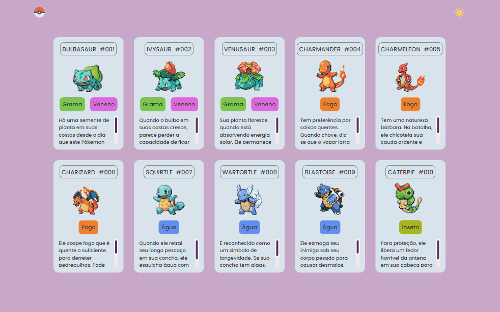
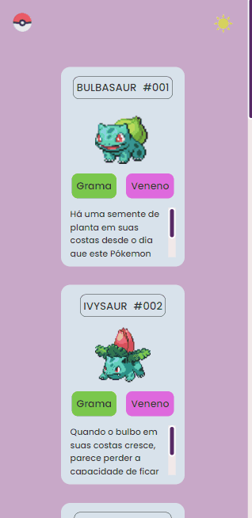

# Projeto Pokémon 

## Descrição
Projeto realizado durante a Semana Do Zero Ao Programador Contratado, evento realizado pelos DevEmDobro.

## Objetivos
- Cards com gifs de Pokémons, seus nomes e suas descrições. 
- Além de mudar o tema para claro ou escuro. 

## Desktop Preview

### Mobile Preview

## Tecnologias
- HTML
- CSS
- JS